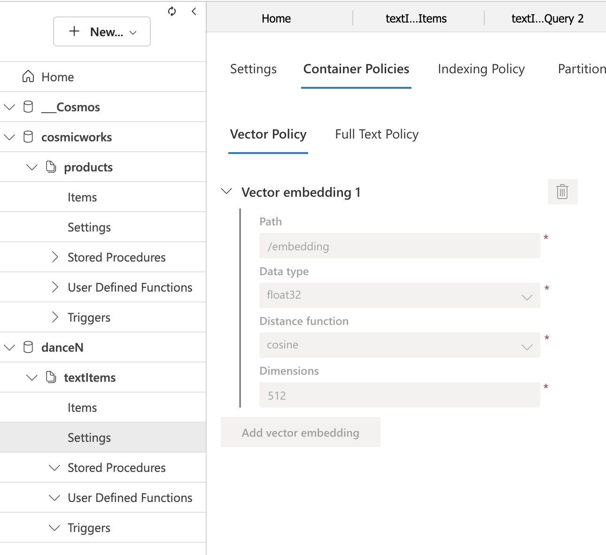

# Sundance - plugable AI chatbox
This is both client and server sides of the chatbox.

The client is SPA built with native JS for browser. (currently even no React is used)
The server part is built with Node.js and Express.js. 

It uses CLIP model to generate embeddings for text and images and [Gemini 2.5 Pro](https://cloud.google.com/vertex-ai/generative-ai/docs/models/gemini/2-5-pro) model as LLM. To observe the seurity issues of Gemini 2.5 Pro model, see [here](https://storage.googleapis.com/model-cards/documents/gemini-2.5-pro.pdf).

The server side of Sundance is used as a wrapper for GraphQL Server exposed to LLM via the universal' tool. 
It depends on the LLM's ability to use the 'function calling' feature.

Practically, Sundance server combines the user's input with a GraphQL schema and asks the LLM tool (executeGraphQL) with a query generated for the specific user's input. The shape of the response is actually defined by the GraphQL schema provided in the prompt. After the tool is called, it tries to execute the query against the configured GraphQL server (via the GRAPHQL_URL environment variable defined in the .env file).

### How to build
1. Re-create .env file by [authenticate](https://onedrive.live.com/?id=f7fcac94e18e43af8ed195c15f222c9b&cid=AAB8403F89EC60E6) to give the working file)
```
LOGIN_URL = https://api.tel-aviv.gov.il/sso/login
TOKEN_VALIDATION_URL = https://api.tel-aviv.gov.il/sso/validate_token
GRAPHQL_URL=<xxx>
CLIENT_ID=<xxx>
LOGIN_SCOPE=xxx
LOGIN_DEVICE_ID=xxx
GEMINI_API_KEY=xxx
ANTHROPIC_API_KEY=xxx
HF_KEY=xxx
SITE_MAP_URL=https://www.tel-aviv.gov.il/sitemap.xml
COSMOS_CLIENT_URL=https://sundance.documents.azure.com:443/
COSMOS_CLIENT_KEY=<xxx>
COSMOS_DATABASE_NAME=<xxx>
COSMOS_CONTAINER_NAME=<xxx>
TOP_N=3
```
2. Run `npm install` to install dependencies
3. Run `npm run build` to build the project
4. Run `npm run start` to start the server 

### How to deploy
This is Node.js application. It can be deployed to any server that supports Node.js, including MS Azure.
Front-end HTML page (index.html) is available once the node app is running.
When running for the first time, the page requests the permissions to use microphone, camera, and geolocation on the user's device. 

### How to use
1. Ensure that Azure Cosmos DB is running and accessible. Development configuration assumes the container 'danceR' and the database 'TextUnits'.
#### Configure Cosmos DB for vector search

1. Create a Cosmos DB account with Azure Cosmos DB for NoSQL.
2. Create a database and a container.
3. Enable vector search on the container: In Azure Portal



1a. Alternatively you can use QDrant Run QDrant server on local on Azure-based Docker container.
```
docker run -p 6333:6333 -p 6334:6334 \
    -v "$(pwd)/qdrant_storage:/qdrant/storage:z" \
    qdrant/qdrant
```
If run locally, the QDrant dashboard Web UI is accesible by
```
http://localhost:6333/dashboard
```
2. Run the /indexer endpoint webhook to build the QDramt collection as vector db store. The request should include the URL to the *sitemaps.xml* file of the website.
```
{
    "url": "https://www.tel-aviv.gov.il:443/sitemap0.xml",
    "lang": "he" // or 'en'
}
```

This webhook should be called by CMS when new content is added/deleted/changed to the website.

The webhook returns immediately (202 Accepted HTTP status code) and starts the indexing process in the background. The result of the index is the updated QDrant vector store.

3. Aquire access token (JWT) Any call to Sundance server should include the access token in the Authorization header (e.g. `Authorization: Bearer <access_token>`).

The tokens are validated against the TOKEN_VALIDATION_URL (e.g. `https://api.tel-aviv.gov.il/sso/validate_token`) endpoint.

4. Issue htpp POST to /chat with this JWT and JSON like:
```
{
    "data": "מה החוב שלי לארנונה?"
} 
```

5. The response will be SSE stream of events generated by final LLM answer.

### Notes on RAG
Vector DB is used to store the embeddings of the text content of the website. The embeddings are then used to find the most similar documents to the user's query.
The Vector DB used in this project is Cosmos DB on Azure. Connection string to the DB is defined in the .env file.
This project uses Xenova/clip-vit-base-patch32 model for image embeddings. CLIP model is used to generate embeddings for images and text. The embeddings are then stored in QDrant vector database.

