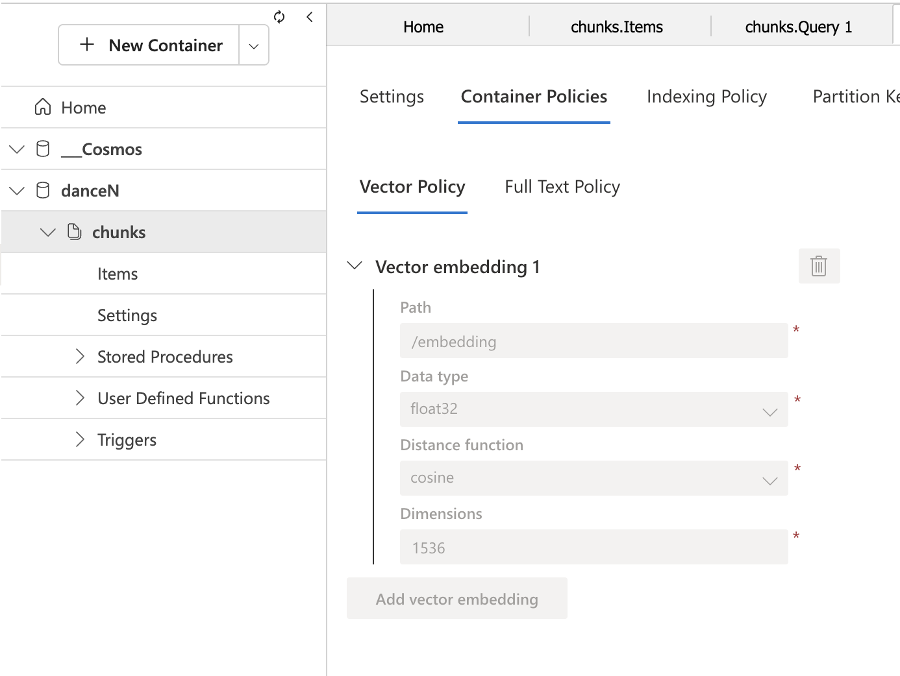

# Sundance - plugable AI chatbox
## Overview
Sundance is a pluggable, privacy-respecting AI chatbox that integrates:

•	A lightweight browser-based SPA frontend (native JavaScript, no frameworks).

•	A backend built in Node.js + Express.

•	Embedding generation via OpenAI 'text-embedding-3-small' model.

•	RAG-based retrieval from Cosmos DB

•	LLM generation via Gemini 2.5 Pro LLM.

•	Access control via JWT authentication validated by a Tel Aviv municipality SSO.

## Components

### 1. Frontend  (Client)

* Served as index.html with vanila JS (no React or frameworks)
* Prompts for microphone, camera, geolocation permissions on load.
* Present the microphone icon that starts the Voice Recognition with browser build-in [speech recognition API](https://developer.mozilla.org/en-US/docs/Web/API/SpeechRecognition).
* The recognition begins when the end-user clicks on the microphone icon.
* The recognition ends when the API decides that the end-user stopped speaking.
* When speaking, the microphone icon glows and the text over it changes to "Listening...".
* Once the recognition completed, the spoken utterance is presented under the microphone and and the caption changes to "Thinking..." . Then the user input is sent to the backend via HTTP POST request to /init endpoint.
* The backend sends the user input to the LLM via HTTP POST request to /completion endpoint.
* The LLM sends the response to the frontend via HTTP GET request to /completion endpoint.
* The frontend displays the response in the animated running line below the shown user input.

### 2. Backend (Server)

•	Built with Node.js and Express.js.

•	Handles with middleware authentication via JWT.

•	Exposes multiple endpoints:

*  **/ingest** - Ingests website content for RAG.
```javascript
/**
 * @swagger
 * /ingest:
 *   tags: [Ingest]
 *   post:
 *     summary: Ingests website content for RAG
 *     tags: [RAG]
 *     responses:
 *       202:
 *         description: Accepted 
 *     requestBody:
 *       required: true
 *       content:
 *         application/json:
 *           schema:
 *             type: object
 *             properties:
 *               url:
 *                 type: string
 *                 example: "https://www.tel-aviv.gov.il:443/sitemap0.xml"
 *               lang:
 *                 type: string
 *                 example: "he"
 */    
```

*  **/init** - Initializes a new conversation. Stores in the session variabl the user's utterance.
```javascript
/**
 * @swagger
 * /init:
 *   post:
 *     summary: Initialize a new conversation
 *     tags: [Chat]
 *     responses:
 *       200:
 *         description: Success 
 *     security:
 *       - bearerAuth: []
 *     requestBody:
 *       required: true
 *       content:
 *         application/json:
 *           schema:
 *             type: object
 *             properties:
 *               data:
 *                 type: string
 *                 example: מה החוב שלי לארנונה?
 */
``` 
* ***/completion** - Performs the RAG step by a help of hybridRetriever. Sends the stored in session user's input in the context of the documents received on RAG step.
```javascript
/**
 * @swagger
 * /completion:
 *   get:
 *     summary: Get chat completion response via Server-Sent Events (SSE)
 *     tags: [Chat]
 *     responses:
 *       200:
 *         description: Success
 *         content:
 *           text/event-stream:
 *             schema:
 *               type: string
 *               example: |
 *                 event: message
 *                 data: {"text":"להלן פרוט החובות שלך..."}
 *     security:
 *       - bearerAuth: []
 */
 ``` 

•	Requires JWT bearer token for all endpoints (Authorization: Bearer <token>).

•	Uses environment configuration via .env file.

•	Validates tokens using TOKEN_VALIDATION_URL.

## Embedding + RAG Pipeline

### Process:
1.	Extract page content using URLs from the provided sitemap.
2.	Split content into chunks (MAX_CHUNK_LENGTH).
3.	Generate embeddings for each chunk using the 'text-embedding-3-small' model.
4.	Store the embeddings in a vector database - Cosmos DB
5.	During query:
    * Generate embedding for the query using the 'text-embedding-3-small' model.
    * Find top-N similar chunks (SEARCH_TOP_N) via vector similarity.
    * Send them along with the original question to the LLM.LM.
    * Receive the response from the LLM.

## Cosmos DB embedding search logic
1. At module level, the Azure Cosmos DB database and container are created if they do not exist.

After successful execution the container looks as follows in Azure Portal:

```
path: '/embedding',
dataType: VectorEmbeddingDataType.Float32,
distanceFunction: VectorEmbeddingDistanceFunction.Cosine,
dimensions: EMBEDDING_VECTOR_SIZE
```
2. **/ingest** endpoint is called to ingest the website content into Cosmos DB vector store.
The HTTP body of this invocation typically looks like:
```json 
{
    "url": "https://www.tel-aviv.gov.il:443/sitemap0.xml",
    "lang": "he" // or 'en'
}
```
3. This endpoint could be served as webhook that called by CMS when new content is added/deleted/changed to the website.
4. The /ingest endpoint returns immediately with 202 Accepted HTTP status code and starts the indexing process in the background
4. /ingest endpoint is protected by "x-api-key" header" that should contain the API_KEY that compared to the one stored in the .env file.
5. /ingest endpoint utilizes the created Cosmos DB infrastructure and parses the HTML pages referred in the passed sitemap.xml. 

The sitemap structure is as follows:
```xml
<?xml version="1.0" encoding="utf-8" standalone="yes"?>
<urlset xmlns="http://www.sitemaps.org/schemas/sitemap/0.9">
<!--  Digitel-->
  <url>
      <loc>https://www.tel-aviv.gov.il/Residents/Digitel/Pages/Digitel.aspx</loc>
      <lastmod>2025-02-27T14:09:54Z</lastmod>
  </url>
  <url>
      <loc>https://www.tel-aviv.gov.il/Residents/Digitel/Pages/DigiDog.aspx</loc>
      <lastmod>2025-02-27T14:09:54Z</lastmod>
  </url>
  ...
   <url>
      <loc>https://www.tel-aviv.gov.il/Residents/Transportation/Pages/Payments.aspx</loc>
      <lastmod>2025-02-27T14:09:54Z</lastmod>
  </url> 
```

5. The **/ingest** endpoint then processes the refered pages in batches of INGESTION_BATCH_SIZE (default is 10).
If needed, each fetched page is chunked into MAX_CHUNK_LENGTH (default is 200) and these chunks' embeddings are upserted to the Cosmos DB container.
Thanks to OpenAI's embeddings API, this process is efficient and fast because it allows to generate embeddings for multiple texts in a [single](openai.embeddings.create) request.
Additional fields are upserted as well:

**- url**: the URL of the page like "https://www.tel-aviv.gov.il/Residents/Digitel/Pages/Digitel.aspx",

**- text**: the text of the chunk

Example of the inserted document:
```json
{
   "id": "962abab0-412e-4c72-b365-81f9fde6e494",
   "embedding": [
      0.000000,
      0.000000,
      ...
   ],
   "TenantId": "12345678-1234-1234-1234-123456789012",
   "payload": {
      "text": "The text of the chunk",
      "url": "https://www.tel-aviv.gov.il/Residents/Digitel/Pages/Digitel.aspx"
   }
}
```

The system uses [Gemini 2.5 Pro](https://cloud.google.com/vertex-ai/generative-ai/docs/models/gemini/2-5-pro) model as the default LLM.  

### Data Privacy

[Google Gemini governance policy](https://cloud.google.com/gemini/docs/discover/data-governance) states:
> Gemini doesn't use your prompts or its responses as data to train its models.


## GraphQL Integration

Sundance’s backend acts as a wrapper for a GraphQL server exposed to the LLM via a universal **executeGraphQL** tool.
It relies on the LLM’s function-calling capability. Sundance dynamically:

* Combines the user’s input with a GraphQL schema to ask LLM to generate a valid query.
The prompt presented to LLM could look like:
```text
---
model: googleai/gemini-2.5-pro
config:
    temperature: 0.9
input:
    schema:
        schemaSDL: string
        userInput: string

---

{{role "system"}}
You are a helpful assistant with access to a GraphQL schema and relevant context retrieved using semantic search. Your primary goal is to answer user questions by generating a GraphQL query and then using the `executedGraphQL` tool to run it.
You will be given a GraphQL schema and a user's question. Follow these steps:
1. Analyze the user's question.
2. Examine the provided GraphQL schema to understand the available data, types, and queries.
3. Construct a valid GraphQL query to retrieve the information needed to answer the user's question.
4. Call the `executedGraphQL` tool with the query you constructed.
5. Once you receive the data from the tool, formulate a clear, natural-language answer for the user. Do not show the raw data in your response.
6. If the `executedGraphQL` tool returns an error, analyze the error message. If it is a GraphQL syntax or validation error, correct your query based on the feedback and the schema, then call the tool again.

Here is the GraphQL schema you must use:
---
{{schemaSDL}}
---
Answer in Hebrew.
---

{{role "user"}}
User Question: "{{userInput}}"
```
* Injects it into the prompt
* Uses the tool call (executeGraphQL) to generate and run a valid query against the GraphQL server (defined by GRAPHQL_URL in the .env file)

### GraphQL Schema Integration in Prompt

**User asks:** “איזה אירועים מתוכננים בפארק הירקון בשבוע הקרוב?”

**LLM Prompt Includes:**

* Chunks about events and parks (from vector DB RAG Step).

* GraphQL schema with type Event, including location, date, description.

**Expected LLM Behavior:**
	
* Uses the GraphQL schema to construct the query.

* Pass the produced query to the provided tool `executeGraphQL`.
```graphql
query PublicEvents {
  publicEventsConnection(filter: { location: "פארק הירקון", date: { gte: "2025-07-21" } }) {
    totalCount
    edges {
      node {
        id
        name
        description
        date
      }
    }
  }
}    
```

## Environment Variables (.env)
1. [Authenticate](https://onedrive.live.com/?id=f7fcac94e18e43af8ed195c15f222c9b&cid=AAB8403F89EC60E6) to get the working file.
```
# Authentication
LOGIN_URL=
TOKEN_VALIDATION_URL=
CLIENT_ID=
LOGIN_SCOPE=
LOGIN_DEVICE_ID=
TENANT_ID=

# Vector DB
COSMOS_CLIENT_URL=
COSMOS_CLIENT_KEY=
COSMOS_DATABASE_ID=chunks
COSMOS_CONTAINER_ID=danceR
SEARCH_TOP_N=3

# LLMs & Embeddings
GEMINI_API_KEY=
OPENAI_API_KEY=
ANTHROPIC_API_KEY=
EMBEDDING_MODEL=text-embedding-3-small
HF_KEY= # for Xenova CLIP
MAX_CHUNK_LENGTH=200

# GraphQL
GRAPHQL_URL=http://localhost:8080

# Server
PORT=8099
API_KEY=
INGESTION_BATCH_SIZE=10
```

## How to build
1. Run `npm install` to install dependencies
3. Run `npm run start` to start the server 

## Deployment
This is Node.js application. It can be deployed to any server that supports Node.js, including MS Azure.
Front-end HTML page (index.html) is available once the node app is running.
When running for the first time, the page requests the permissions to use microphone, camera, and geolocation on the user's device. 

### How to use
1. Ensure that Azure Cosmos DB account is exists.
Its connection string is defined in the .env file in the two variables: 
```
COSMOS_CLIENT_URL=<xxx>
COSMOS_CLIENT_KEY=<xxx>
```
2. Start the server by running `npm run start`.
3. Invoke the indexer endpoint by issuing a POST request to `/ingest` endpoint

This creates the Azure Cosmos database, and container. Development configuration assumes the container 'chunks' and the database 'danceN'.

3. Aquire access token (JWT) Any call to Sundance server should include the access token in the Authorization header (e.g. `Authorization: Bearer <access_token>`).

The tokens are validated against the TOKEN_VALIDATION_URL (e.g. `https://api.tel-aviv.gov.il/sso/validate_token`) endpoint.

4. Issue htpp POST to /completion endpoint with this JWT and JSON like:
```json
{
    "data": "מה החוב שלי לארנונה?"
} 
```

5. The response will be SSE stream of events generated by final LLM answer.

### Notes on RAG
Cosmos DB is used to store the embeddings of the text content of the website. The embeddings are then used to find the most similar documents to the user's query.
Connection string to the DB is defined in the .env file.
This project uses OpenAI 'text-embedding-3-small' model for text embeddings.


## File Structure 
sundance/
├── .gitignore
├── .vscode/
│   ├── launch.json
│   └── tasks.json
├── llm_prompts/
│   ├── graphql_agent.prompt
│   └── schema.graphql
├── src/
│   ├── cosmosDB/
│   │   ├── utils.ts
│   ├── flows/
│   │   └── completionFlow.ts
    │   ├── ingestionFlow.ts
│   │   └── searchFlow.ts
├── retrievers/
│   ├── hybridRetriever.ts
├── tools/
│   ├── executeGraphQL.ts
├── public/
│   └── index.html
├── .env
├── genkit.ts
├── index.ts
├── package-lock.json
├── package.json
└── README.md

